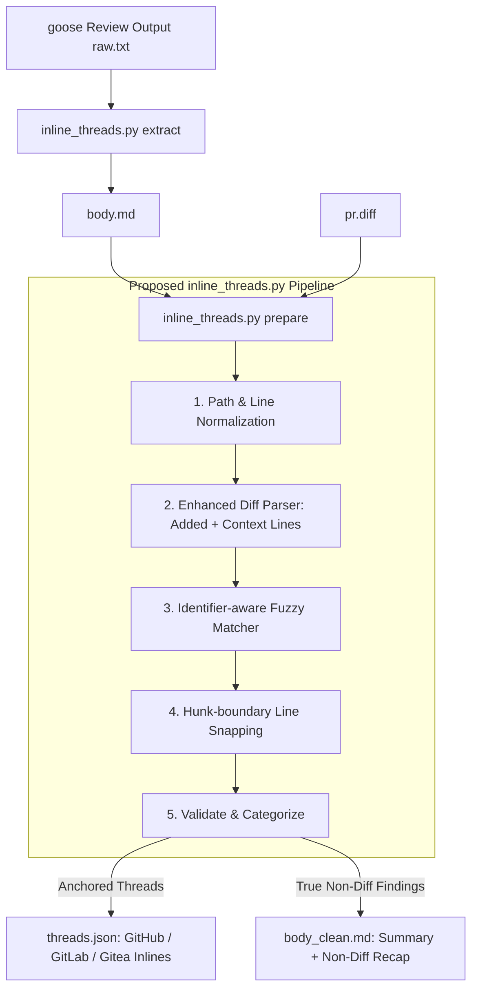

# Requirements

### Overview & Goals
CodeGoose 기반 PR 코드 리뷰 시, PR 리뷰 코멘트 본문 하단에 `## Not anchored to the diff` 섹션이 노출되는 문제의 근본 원인을 분석하고, 인라인 코멘트 성공률을 높이고 불필요한 경고 노출을 최소화하기 위한 종합적인 개선 계획을 수립합니다.

### Scope
- **In Scope:**
  - `scripts/inline_threads.py`의 diff 파싱, 경로 정규화, 앵커 유효성 검증, 퍼지 매칭 로직 분석 및 개선안
  - `templates/instructions.graded.md`, `codegoose-review.yaml`의 프롬프트 지침 및 라인 인용 규칙 최적화
  - GitHub, GitLab, Gitea, TeamCity 등 다중 플랫폼 CI 템플릿과의 호환성 검증 및 테스트 보강
- **Out of Scope:**
  - GitHub / GitLab의 외부 API 스펙 변경 (플랫폼 자체 제약사항 준수)
  - goose CLI 바이너리 내부 구현 수정

### Root Cause Analysis (원인 분석 요약)
PR 코멘트에 `## Not anchored to the diff`가 나타나는 이유는 goose AI가 작성한 코드 지적 항목(`- [file:line]`)이 `scripts/inline_threads.py`의 diff 앵커링 검증 단계에서 탈락하여 `skipped` 목록으로 분류되었기 때문입니다.

1. **`parse_diff_anchors`의 컨텍스트 라인 누락 (핵심 버그):**
   - docstring에는 "Context and added lines are both anchorable"로 기술되어 있으나, 실제 코드(196행)에서는 `raw.startswith("+")`인 추가 라인만 `table`에 포함하고 컨텍스트 라인(` `)을 제외함.
   - GitHub/GitLab API는 diff hunk에 포함된 변경 전후 컨텍스트 라인에도 인라인 코멘트 작성을 지원하지만, 스크립트가 이를 거부함.
2. **한국어 리뷰 본문과 영어 diff 코드 간 퍼지 매칭 실패:**
   - `_match_by_content`가 본문 전체 텍스트(`b["body"]`)와 diff 코드 라인의 토큰 일치율(>=50%)을 비교함.
   - 한국어로 작성된 리뷰 설명(`x 값이 덮어써져 오류가 발생할 수 있음`)은 diff 내 영어 코드 식별자와 일치율이 0%에 가까워 퍼지 매칭이 작동하지 않음.
3. **경로 정규화 부재 (`./`, 상대 경로 불일치):**
   - LLM이 `./src/foo.py` 형태로 인용할 경우 diff 파서의 `src/foo.py`와 불일치하여 앵커링 실패.
4. **LLM의 라인 번호 산출 오차 (전체 파일 라인 vs Diff Hunk New-side 라인):**
   - LLM이 diff hunk의 new-side 라인 번호(`+c,d`) 대신 로컬 저장소 전체 파일의 절대 라인 번호나 old-side(`-a,b`) 라인을 인용하는 현상.
   - PR 변경 대상이 아닌 외부 파일(호출부, 설정 파일 등)을 지적하여 diff hunk에 파일 자체가 존재하지 않는 경우.
5. **다중 라인 범위(Range) 및 Hunk 경계 처리 미흡:**
   - `file:10-20`과 같은 범위 인용 시 시작 라인 또는 끝 라인이 diff hunk 영역을 벗어나면 단일 라인으로 fallback되거나 탈락함.

### Functional Requirements
- **FR-1:** diff hunk 내에 존재하는 모든 new-side 라인(추가 라인 `+` 및 컨텍스트 라인 ` `)을 올바른 인라인 코멘트 앵커로 인식해야 합니다.
- **FR-2:** 파일 경로의 다양한 표현(`./`, `b/`, `/` 접두사 등)을 정규화하여 경로 불일치로 인한 탈락을 방지해야 합니다.
- **FR-3:** 한국어/다국어 리뷰 본문에서도 코드 블록 및 식별자를 추출하여 diff 라인에 정확히 매핑하는 지능형 라인 보정을 지원해야 합니다.
- **FR-4:** diff에 포함되지 않은 파일 지적과 단순 라인 번호 오차를 구분하여, 실제 diff 범위 내 지적은 인라인으로 최대한 살려내고 diff 외 지적만 summary에 명확히 표기해야 합니다.
- **FR-5:** 기존 CI 파이프라인(GitHub Actions, GitLab CI, Gitea, TeamCity)의 하위 호환성을 100% 유지해야 합니다.

# Technical Design

### Current Implementation
현재 `scripts/inline_threads.py`의 처리 파이프라인:
1. `split_threads`: 본문에서 Blocking, Warnings, Suggestions 섹션의 `- path:line` bullet을 파싱
2. `parse_diff_anchors_with_content`: `pr.diff`를 읽어 유효한 라인 테이블 생성
   - **문제점:** `parse_diff_anchors` 196행에서 `raw.startswith("+")`만 추가하여 컨텍스트 라인(` `) 누락
3. `_match_by_content`: 라인 번호 불일치 시 `b["body"]` 토큰과 diff 라인 토큰의 50% overlap 검사
   - **문제점:** 다국어/한국어 본문 지원 불가, 토큰 분모(`len(tokens)`) 계산으로 매칭 확률 저조
4. `validate_and_anchor`: 앵커 테이블에 없는 bullet을 `skipped`에 추가 후 `## Not anchored to the diff` 헤더를 붙여 요약 본문에 추가

### Architecture Diagram



### Key Decisions
1. **컨텍스트 라인 포함 (Decision 1):**
   - *선택:* diff hunk 내의 모든 `+` 및 ` ` 라인을 유효 앵커 라인으로 등록.
   - *근거:* GitHub Review API 및 GitLab Discussions API는 hunk 내부의 컨텍스트 라인에 대한 인라인 코멘트 생성을 공식 지원하며, 422 에러가 발생하지 않음.
2. **코드 식별자 기반 토큰 추출 (Decision 2):**
   - *선택:* `_match_by_content` 시 본문 전체 대신 백틱(`` `...` ``), 큰따옴표, 함수/변수명 패턴(`[a-zA-Z_][a-zA-Z0-9_]*`)만 추출하여 매칭.
   - *근거:* 한국어 조사/설명어와 분리하여 실제 언급된 코드 심볼과 diff 라인의 일치율을 정확하게 평가 가능.
3. **인접 Hunk 라인 스냅 (Decision 3):**
   - *선택:* 지적된 라인이 동일 파일의 diff hunk 경계 밖 1~3라인 이내인 경우 가장 가까운 diff hunk 라인으로 스냅(Snap).
   - *근거:* LLM이 함수 선언부나 닫는 괄호를 지적할 때 발생하는 사소한 오프셋 오차로 인해 인라인 코멘트가 통째로 누락되는 현상 방지.

### Data Models & Contracts
- **경로 정규화 로직:**
```python
def normalize_path(path: str) -> str:
    p = path.strip().strip("`").strip("'\"")
    p = re.sub(r"^[ab]/", "", p)
    p = re.sub(r"^\./", "", p)
    return os.path.normpath(p).lstrip("/\\")
```

- **개선된 `parse_diff_anchors`:**
```python
def parse_diff_anchors(diff_text):
    table = {}
    path = None
    in_hunk = False
    new_start = new_count = seen = 0
    for raw in diff_text.splitlines():
        if raw.startswith("diff --git"):
            in_hunk, path = False, None
            continue
        if raw.startswith("+++ "):
            path = normalize_path(raw[4:].strip())
            continue
        if raw.startswith("@@"):
            m = HUNK_RE.match(raw)
            if m:
                new_start = int(m.group(1))
                new_count = int(m.group(2) or 1)
                seen = 0
                in_hunk = True
            continue
        if not in_hunk or path is None or seen >= new_count:
            continue
        # Context (' ') and added ('+') lines are both anchorable
        if raw.startswith("+") or raw.startswith(" "):
            table.setdefault(path, set()).add(new_start + seen)
            seen += 1
    return table
```

### Risks & Mitigations
- **리스크 1:** 잘못된 diff 라인 스냅으로 인해 엉뚱한 위치에 코멘트가 달릴 위험.
  - *대응:* 식별자 일치율 또는 ±3라인 이내의 엄격한 임계값을 적용하고, 매칭 점수가 낮을 경우 스냅하지 않고 summary로 안전하게 강등.
- **리스크 2:** GitHub Review API의 다중 라인 범위 에러.
  - *대응:* `start_line`과 `line`이 동일한 diff hunk 내에 존재하지 않는 경우 범위를 단일 라인으로 자동 축소.

# Testing

### Validation Approach
단위 테스트(`inline_threads.py selftest`), 플랫폼 검증(`scripts/verify.py`), 모의 diff/리뷰 페이로드 테스트를 통해 개선 사항을 철저히 검증합니다.

### Key Scenarios
1. **컨텍스트 라인 앵커링 검증:**
   - diff hunk 내의 변경되지 않은 컨텍스트 라인(예: `src/a.py:3`)을 지적했을 때 `Not anchored`로 가지 않고 정상적으로 `threads.json`에 포함되는지 확인.
2. **한국어 본문 + 코드 식별자 퍼지 매칭 검증:**
   - 한국어 설명에 코드 식별자(예: `calculateTotal`, `userId`)가 포함된 지적 사항이 diff hunk 내의 해당 라인으로 정확히 remapping되는지 확인.
3. **경로 정규화 검증:**
   - `./src/component/App.tsx`, `b/src/component/App.tsx`, `src/component/App.tsx` 등 다양한 경로 인용이 동일한 diff 파일로 매칭되는지 확인.
4. **다중 라인 범위 검증:**
   - hunk 내부 범위(`:10-15`)는 정상 범위 코멘트(`start_line: 10, line: 15`), hunk 경계를 넘는 범위는 단일 라인 코멘트로 축소되는지 확인.
5. **diff 외부 파일 지적 처리:**
   - PR diff에 없는 파일(예: `docs/readme.md:50`) 지적은 에러 없이 summary의 `Not anchored to the diff` 리캡으로 안전하게 보존되는지 확인.

### Edge Cases
- 빈 diff, 바이너리 파일 diff, 단일 라인 hunk (`@@ -0,0 +1 @@`), 삭제만 있는 hunk
- 55,000자 초과 긴 리뷰 본문 클램핑 시 리캡 섹션 보존 여부
- `MAX_THREADS` (10개) 초과 시 상위 10개 인라인 코멘트 추출 및 초과분 안내 메시지 유지 여부

# Delivery Steps

### ✓ Step 1: Refactor diff parsing and anchor validation in inline_threads.py
diff hunk 내 유효 라인 수집 로직과 경로 정규화가 개선되어 컨텍스트 라인 및 다양한 경로 포맷에서도 앵커링이 정상 작동합니다.

- `parse_diff_anchors` 함수에서 추가 라인(`+`)뿐만 아니라 diff hunk 내의 컨텍스트 라인(` `)도 유효 앵커 라인(`table`)에 등록하도록 수정
- `_first_anchor` 및 `parse_diff_anchors`에서 `./`, `b/`, `a/`, 역슬래시(`\`) 등 상대 경로 접두사를 일관되게 정규화(`os.path.normpath` / `lstrip("./")`)
- 다중 라인 범위(`start_line` ~ `line`) 지정 시 두 라인이 동일한 연속 hunk 내에 위치하는지 검증하는 로직 추가
- 삭제된 라인 또는 hunk 직전/직후 범위 지적 시 가장 가까운 diff hunk 라인으로 스냅(snap)하는 보정 처리 도입

### ✓ Step 2: Enhance fuzzy matching and line correction algorithm
한국어 및 다국어 리뷰 본문에서도 코드 식별자 기반으로 diff 라인 매칭이 정상 작동하도록 퍼지 매칭 엔진을 고도화합니다.

- `_match_by_content`에서 본문 전체 자연어 토큰 대신 백틱(`` `...` ``) 및 코드 식별자 위주로 토큰을 추출하여 유사도 비교하도록 개선
- 지적된 파일이 diff에 존재할 경우, 오차 범위(tolerance threshold, 예: ±5 라인) 내의 가장 가까운 유효 diff 라인으로 자동 보정
- 파일 전체가 diff에 없는 외부 파일 지적과 diff 라인 오차 지적을 구분하여 에러 리캡 메시지 명확화

### ✓ Step 3: Align instructions and prompts across templates and recipes
AI 모델이 diff hunk 기준의 정확한 라인 번호를 인용하도록 프롬프트 지침과 출력 포맷을 최적화합니다.

- `templates/instructions.graded.md` 및 `codegoose-review.yaml`의 인용 가이드라인을 통일하고 구체적인 new-side hunk 라인 작성 예시 제공
- 변경되지 않은 외부 파일이나 전역 아키텍처 관련 지적은 가짜 라인 번호를 부여하지 않고 `## Summary` 또는 전역 섹션에 작성하도록 명시
- `scripts/render.py`를 통해 플랫폼별 워크플로 파일(`.github/workflows/goose-review.yml` 등)을 재렌더링하여 갱신

### ✓ Step 4: Add comprehensive selftest cases and verify platform compatibility
다양한 diff 패턴, 다국어 본문, 컨텍스트 라인 인용 케이스에 대한 단위 테스트를 구축하고 플랫폼 검증을 통과합니다.

- `scripts/inline_threads.py` 내 `_selftest()`에 컨텍스트 라인 앵커링, 다중 라인 범위, 한국어 본문 퍼지 매칭, 경로 정규화 테스트 케이스 추가
- `scripts/verify.py`를 실행하여 GitHub, GitLab, Gitea, TeamCity 전 플랫폼 렌더링 및 계약 검증 수행