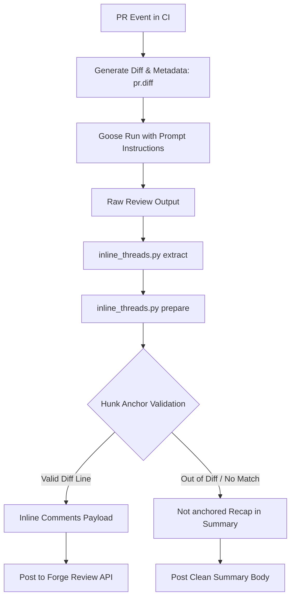

# Requirements

### Overview & Goals
In PR #6, automated AI code reviews generated findings that appeared under the section `## Not anchored to the diff` rather than being posted as inline comments on the PR diff. In addition, automated and bot reviews on PR #6 surfaced 8 distinct feedback comments regarding provider compatibility, CI platform timeout settings, ID stability in TeamCity, template format consistency, dead code, and documentation synchronization.

The objective of this plan is to:
1. Maximize overall CI automation utility and review effectiveness by analyzing and resolving the root cause of the "Not anchored to the diff" issue.
2. Formally evaluate each review comment on PR #6, implementing valid improvements and providing clear technical rationale for any false positives.
3. Ensure absolute consistency across prompt templates, renderer logic, CI platform templates, and automated verification suites.

### Scope
- **In Scope**:
  - Root cause diagnosis of unanchored diff comments in `scripts/inline_threads.py` and review prompt instructions.
  - Prompt and template alignment across `templates/instructions.graded.md` and `codegoose-review.yaml`.
  - Parser refinement in `scripts/inline_threads.py` for line citations.
  - Verification script (`scripts/verify.py`) and renderer (`scripts/render.py`) adjustments.
  - CI template synchronization (`templates/gitlab.ci.yml`, `templates/teamcity.settings.kts`, `templates/github.workflow.yml`, `templates/gitea.workflow.yml`).
  - Regeneration of `.github/workflows/codegoose-review.yml` and recipe deeplinks in `README.md` / `README.ko.md`.
- **Out of Scope**:
  - Replacing the native Goose `fireworks-ai` provider with an OpenAI proxy (as Goose natively supports Fireworks AI).
  - Modifying unrelated CI platforms or adding non-standard provider integrations.

### User Stories
- As a **developer submitting a PR**, I want review findings to appear directly as inline comments on the relevant diff lines so that I can immediately understand and address feedback in context.
- As a **team maintaining CI pipelines**, I want CI templates across GitHub, GitLab, Gitea, and TeamCity to have consistent 15-minute timeouts, persistent build IDs, and accurate secret mappings so that pipeline runs are reliable and maintainable.
- As a **codebase reviewer**, I want prompt instructions and recipe schemas to enforce clean Markdown heading anchors so that automated parser tools never drop or misplace review comments.

### Functional Requirements
- **Diff Anchor Reliability**: Findings under `## 🔴 Blocking Issues`, `## 🟡 Warnings`, and `## 🟢 Suggestions` must target valid new-side line numbers within the PR's unified diff hunks (`pr.diff`).
- **Prompt Format Uniformity**: Category headers must strictly match `## 🔴 Blocking Issues`, `## 🟡 Warnings`, `## 🟢 Suggestions`, `## ✅ Highlights`, and `## Verdict` without extra suffixes in both CI instructions and recipe files.
- **GitLab Timeout Consistency**: GitLab CI template must configure `timeout: 15 minutes` and `scripts/verify.py` must validate this constraint.
- **TeamCity Build ID Stability**: TeamCity DSL template must preserve `id("GooseReview")` while updating the display name to `CodeGoose AI Review`.
- **Provider Normalization & Dead Code Cleanup**: `scripts/render.py` must cleanly map `fireworks-ai` and aliases without unreachable dictionary entries.
- **Full CI Matrix Pass**: All combinations of platforms (4) × providers (5) × styles (2) must render and pass `scripts/verify.py` checks.

# Technical Design

### Current Implementation & Root Cause Analysis

#### 1. Why "Not anchored to the diff" Occurred
In PR #6, the automated review step posted:
```markdown
## Not anchored to the diff
(the following findings could not be pinned to a diff line, so no inline comment was created for them)
- [SUGGESTION] `scripts/verify.py:103` `scripts/verify.py:103,139,165`: GitLab/Gitea/TeamCity 검증은 공급자 키 전체를 `t.count(...)>=1`로만 확인해...
```

The underlying failure sequence was:
1. **Out-of-Diff Citations**: The LLM reviewer analyzed the full file context of `scripts/verify.py` and commented on lines 103, 139, and 165. However, in the PR #6 diff, `scripts/verify.py` only contained diff hunks at lines 19..25, 50..61, 87..101, and 126..137. Lines 103, 139, and 165 were not part of any modified hunk.
2. **Comma-Separated Multi-line Formatting**: The LLM produced `scripts/verify.py:103,139,165`. `PATH_LINE_RE` (`r"`?/?([\w./\\-]+?)`?:(\d+)(?:-(\d+))?"`) parsed only the first number (`103`) and dropped the rest.
3. **GitHub API Rejection Constraint**: GitHub's PR Review Comments API (`POST /repos/{owner}/{repo}/pulls/{pull_number}/reviews`) rejects comments on lines outside the PR's unified diff hunks.
4. **Fuzzy Content Match Miss**: `_match_by_content()` in `scripts/inline_threads.py` attempted token overlap matching, but because the explanation was in Korean and did not share >= 50% token vocabulary with the modified diff lines, fuzzy matching failed.
5. **Safe Fallback**: `scripts/inline_threads.py` safely moved the finding into `## Not anchored to the diff` in the summary comment body to prevent silent loss.

#### 2. Review Comments Analysis and Disposition Matrix

| # | File & Location | Issue / Claim | Disposition & Technical Rationale |
|---|---|---|---|
| 1 | `scripts/render.py:136` | Claim: Goose v1.48.0 does not register `fireworks-ai` provider natively; must use `openai` wrapper or custom provider JSON. | **False Positive (Keep As-Is)**: Static analysis on Goose v1.48.0 CLI confirmed `goose run --provider fireworks-ai` natively connects to `https://api.fireworks.ai/inference/v1/chat/completions` using `FIREWORKS_API_KEY`. |
| 2 | `scripts/verify.py:94` & `templates/gitlab.ci.yml` | GitLab template timeout should be 15 minutes and validated by `scripts/verify.py`. | **Valid (Apply)**: Update `templates/gitlab.ci.yml` to `timeout: 15 minutes` and enforce `d["codegoose_review"].get("timeout") == "15 minutes"` in `scripts/verify.py`. |
| 3 | `templates/github.workflow.yml:18` | Check name / job ID rebranding (`goose-review` -> `codegoose-review`). | **Valid (Apply Uniformly)**: Standardize on `codegoose-review` and `CodeGoose AI Review` across GitHub, GitLab, Gitea, and TeamCity templates and verify scripts. |
| 4 | `templates/teamcity.settings.kts:9` | TeamCity Kotlin DSL object rename changes generated ID, resetting build history. | **Valid (Apply)**: Preserve `id("GooseReview")` inside `object CodeGooseReview : BuildType({ ... })` in `templates/teamcity.settings.kts`. |
| 5 | `codegoose-review.yaml:66` | Output format examples contain `(꼭 고쳐야 함)` and `[file:line]`, conflicting with exact header parsing. | **Valid (Apply)**: Remove descriptive parentheses from headers and align citation format to `` - `path/to/file.ext:line`: <설명> ``. |
| 6 | `scripts/render.py:59` | `API_KEY_NAMES["fireworks"]` is dead code due to earlier normalization via `PROVIDER_ALIASES`. | **Valid (Apply)**: Remove `"fireworks"` from `API_KEY_NAMES` and keep only canonical normalized provider names. |
| 7 | `.github/workflows/codegoose-review.yml:38` | Mismatch between PR description (`nemotron-...`) and workflow (`deepseek-v4-flash-0731`). | **Valid (Apply)**: Synchronize workflow, setup recipe examples, and PR description to the verified `deepseek-v4-flash-0731` model. |
| 8 | `codegoose-review.yaml:8` | Outdated header comments referencing `soolmuk/goose-recipes` and old file names. | **Valid (Apply)**: Update recipe header comments and raw URLs to `soolmuk/CodeGoose`. |

### Key Decisions
- **Decision 1: Enforce Diff-Hunk Citations at Prompt Level**: Provide explicit negative constraints in prompt templates (`templates/instructions.graded.md`, `codegoose-review.yaml`) so the LLM reviewer only cites new-side line numbers within modified hunks, preventing unanchored findings at the source.
- **Decision 2: Strengthen `inline_threads.py` Parser**: Enhance `PATH_LINE_RE` and parsing in `scripts/inline_threads.py` to gracefully handle multiple comma-separated line numbers and prevent regex truncations.
- **Decision 3: Maintain TeamCity Build History**: Use explicit `id("GooseReview")` in TeamCity Kotlin DSL to maximize stability for existing CI setups while updating the display name to `CodeGoose AI Review`.

### Architecture & Data Flow



### File Structure & Changes
- `templates/instructions.graded.md`: Add strict diff-hunk line citation rules and forbid comma-separated line syntax.
- `codegoose-review.yaml`: Align output headers, remove heading suffixes `(꼭 고쳐야 함)`, update top comments and URLs, validate recipe schema.
- `codegoose-setup.yaml`: Update model examples and repository references.
- `scripts/inline_threads.py`: Refine anchor parsing and multi-line handling; update self-tests.
- `scripts/render.py`: Remove dead provider key in `API_KEY_NAMES`; ensure canonical repo raw URLs.
- `scripts/verify.py`: Enforce GitLab 15-minute timeout and validate `codegoose-review` job across all platforms.
- `templates/gitlab.ci.yml`: Set `timeout: 15 minutes` and update download URLs.
- `templates/teamcity.settings.kts`: Add `id("GooseReview")` and update download URLs.
- `templates/github.workflow.yml` & `templates/gitea.workflow.yml`: Ensure `codegoose-review` job name consistency and update download URLs.
- `.github/workflows/codegoose-review.yml`: Re-render using updated templates and render pipeline.
- `README.md` & `README.ko.md`: Update recipe deeplink badges.

# Testing

### Validation Approach
Verification is performed deterministically across all components through automated self-tests, schema validations, and a comprehensive platform-provider-style matrix.

### Key Scenarios

1. **Recipe Schema Validation**
   - Run `goose recipe validate codegoose-review.yaml`
   - Run `goose recipe validate codegoose-setup.yaml`
   - Expected Outcome: Both recipes report valid schema with exit code 0.

2. **Inline Threads & Diff Anchor Self-Tests**
   - Run `python3 scripts/inline_threads.py selftest`
   - Test single line citation: `` `file.py:10` `` -> anchors to line 10.
   - Test range citation: `` `file.py:10-15` `` -> anchors to start line 10, end line 15.
   - Test comma-separated citation: `` `file.py:10,20` `` -> extracts first valid diff line without crashing.
   - Test out-of-diff citation: falls back to `## Not anchored to the diff` without dropping prose.
   - Expected Outcome: All unit checks pass with exit code 0.

3. **Multi-Platform CI Render & Verification Matrix**
   - Execute test across 4 platforms × 5 providers × 2 styles (40 combinations):
     - Platforms: `github`, `gitlab`, `gitea`, `teamcity`
     - Providers: `ollama_cloud`, `anthropic`, `openai`, `openrouter`, `fireworks-ai`
     - Styles: `graded-review`, `changes-summary`
   - For each combination:
     - Render locally: `python3 scripts/render.py <platform> --local --provider <prov> --model <model> --style <style> --dry-run`
     - Verify contract: `python3 scripts/verify.py <platform> <rendered_output>`
   - Expected Outcome: 40/40 combinations pass verification with `RESULT: PASS`.

4. **Goose Provider Execution Check**
   - Test native Fireworks AI provider resolution:
     `FIREWORKS_API_KEY=test goose run --provider fireworks-ai --model accounts/fireworks/models/deepseek-v4-flash-0731 --text "test"`
   - Expected Outcome: Provider connects directly to Fireworks API endpoint (authenticating via API key).

5. **Deeplink & Documentation Consistency**
   - Verify that generated deep link URLs in `README.md` and `README.ko.md` decode to the exact contents of `codegoose-review.yaml` and `codegoose-setup.yaml`.

# Delivery Steps

### ✓ Step 1: Standardize Review Prompt Templates and Citation Rules
Prompt instructions and output formats in `templates/instructions.graded.md` and `codegoose-review.yaml` strictly enforce diff-anchored citation rules and exact English category headers.

- Update `templates/instructions.graded.md` to explicitly require findings under `## 🔴 Blocking Issues`, `## 🟡 Warnings`, and `## 🟢 Suggestions` to cite only new-side line numbers within the unified diff hunks (`pr.diff`), prohibiting comma-separated multi-line syntax.
- Align `codegoose-review.yaml` prompt section by removing descriptive suffixes like `(꼭 고쳐야 함)` from heading examples and standardizing line bullet formats to `` - `path/to/file.ext:line`: <설명> ``.
- Refresh header comments in `codegoose-review.yaml` and `codegoose-setup.yaml` to reference `soolmuk/CodeGoose` and the rebranded `codegoose-review` workflows.
- Verify recipe schema compliance via `goose recipe validate codegoose-review.yaml` and `goose recipe validate codegoose-setup.yaml`.

### ✓ Step 2: Enhance Anchor Parser and Clean Up Renderer Logic
`scripts/inline_threads.py` handles anchor parsing with enhanced fallback tolerance, and `scripts/render.py` eliminates dead provider keys while maintaining alias normalization.

- Refine `PATH_LINE_RE` and anchor extraction logic in `scripts/inline_threads.py` to parse complex or comma-separated line patterns safely, extracting the first valid hunk-anchored line number.
- Remove redundant `"fireworks"` entry from `API_KEY_NAMES` in `scripts/render.py` since `PROVIDER_ALIASES` normalizes `fireworks` and `fireworks_ai` to `fireworks-ai`.
- Confirm `fetch()` and raw URLs in `scripts/render.py` point to `soolmuk/CodeGoose`.
- Run `python3 scripts/inline_threads.py selftest` to verify all parser assertions and edge-case handling pass.

### ✓ Step 3: Synchronize CI Platform Templates and Verification Rules
All CI platform templates (`gitlab.ci.yml`, `teamcity.settings.kts`, `github.workflow.yml`, `gitea.workflow.yml`) and `scripts/verify.py` are strictly synchronized.

- Update `templates/gitlab.ci.yml` to specify `timeout: 15 minutes` (aligning with GitHub and Gitea), and update `scripts/verify.py` `check_gitlab()` to assert `job.get("timeout") == "15 minutes"`.
- Update `templates/teamcity.settings.kts` to explicitly set `id("GooseReview")` on `CodeGooseReview` BuildType to preserve build history and external ID stability.
- Ensure `templates/github.workflow.yml` and `templates/gitea.workflow.yml` consistently define `codegoose-review` job name and `CodeGoose AI Review` display name.
- Update repository download URLs for helper scripts inside all template files from `soolmuk/goose-recipes` to `soolmuk/CodeGoose`.

### ✓ Step 4: Re-render Artifacts and Execute Multi-Platform Validation
Committed workflow artifacts are regenerated from updated templates, documentation is synchronized, and the full multi-platform render/verify matrix passes.

- Re-render `.github/workflows/codegoose-review.yml` via `scripts/render.py` using `fireworks-ai` provider and model `accounts/fireworks/models/deepseek-v4-flash-0731`.
- Regenerate recipe deeplink badges in `README.md` and `README.ko.md` using `goose recipe deeplink` for both `codegoose-review.yaml` and `codegoose-setup.yaml`.
- Execute automated matrix test across all 4 platforms (`github`, `gitlab`, `gitea`, `teamcity`), 5 providers (`ollama_cloud`, `anthropic`, `openai`, `openrouter`, `fireworks-ai`), and 2 styles (`graded-review`, `changes-summary`) using `scripts/render.py` and `scripts/verify.py`.
- Update PR #6 description and documentation to accurately reflect the configured Fireworks AI model and resolved review items.