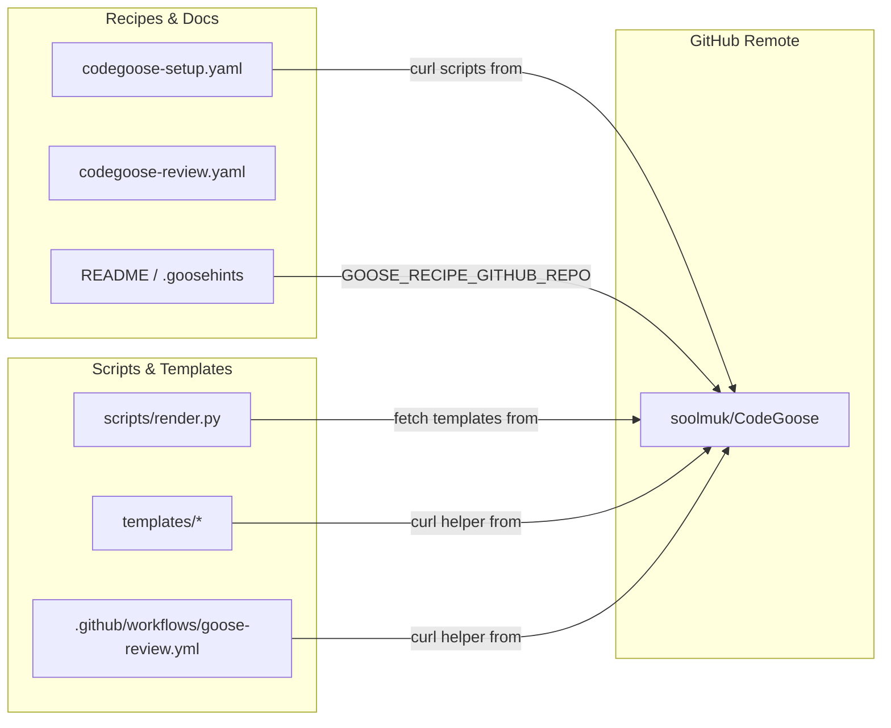

# Requirements

### Overview & Goals
The remote repository name has been renamed to `CodeGoose` (full GitHub path: `soolmuk/CodeGoose`). This plan details updating all repository references, raw URL endpoints, CI templates, recipe definitions, and documentation across the codebase to ensure consistency and prevent broken script/helper downloads.

### Scope
#### In Scope
- **Scripts**: `scripts/render.py` (download URL for remote templates, CLI help messages, and error logs).
- **CI Templates**: `templates/github.workflow.yml`, `templates/gitlab.ci.yml`, `templates/gitea.workflow.yml`, `templates/teamcity.settings.kts` (marker comments and helper script download URLs).
- **CI Workflows**: `.github/workflows/goose-review.yml` (marker comment and script download URLs).
- **Recipes**: `codegoose-setup.yaml` and `codegoose-review.yaml` (descriptions, instructions, script download URLs, and repository references).
- **Documentation**: `README.md`, `README.ko.md`, and `.goosehints` (repository name references, CLI setup commands, and deeplink badges).

#### Out of Scope
- Modifying core review logic, prompt instructions, or grading criteria.
- Changing external upstream URLs (e.g. `aaif-goose/goose` CLI download URLs).
- Modifying repository directory structure or renaming files.

### Functional Requirements
- All raw GitHub content downloads must point to `https://raw.githubusercontent.com/soolmuk/CodeGoose/...`.
- All `GOOSE_RECIPE_GITHUB_REPO` environment variables and CLI URLs in documentation must point to `soolmuk/CodeGoose`.
- All rendered CI header comments must state `Rendered by soolmuk/CodeGoose scripts/render.py - do not hand-edit.`.
- CI verifier `scripts/verify.py` and template rendering via `scripts/render.py` must execute without errors.

# Technical Design

### Current Implementation
The repository currently contains references to the previous name `soolmuk/goose-recipes` and `goose-recipes` in:
- `scripts/render.py`: `fetch()` downloads from `raw.githubusercontent.com/soolmuk/goose-recipes/{ref}/{repo_file}`.
- `templates/*`: Template files include marker comments and `curl` commands downloading `inline_threads.py` from `soolmuk/goose-recipes`.
- `codegoose-setup.yaml`: Setup prompt instructs CI setup drivers to curl `render.py` and `verify.py` from `soolmuk/goose-recipes`.
- `codegoose-review.yaml`: Header comments point to `soolmuk/goose-recipes`.
- `README.md` & `README.ko.md`: Source of truth descriptions and CLI commands point to `soolmuk/goose-recipes`.
- `.goosehints`: Header and text reference `goose-recipes`.
- `.github/workflows/goose-review.yml`: Rendered artifact references `soolmuk/goose-recipes`.

### Key Decisions
- **Standardized Identifier**: Use `soolmuk/CodeGoose` for repository URLs and `CodeGoose` for standalone repository name references.
- **Synchronized CI Artifacts**: Ensure the repository's own `.github/workflows/goose-review.yml` is updated alongside the base `templates/github.workflow.yml`.
- **Deeplink Refresh**: Refresh the base64-encoded `goose://recipe?config=...` deeplinks in `README.md` and `README.ko.md` following changes to `codegoose-setup.yaml` and `codegoose-review.yaml`.

### Affected Files
- `scripts/render.py`
- `templates/github.workflow.yml`
- `templates/gitlab.ci.yml`
- `templates/gitea.workflow.yml`
- `templates/teamcity.settings.kts`
- `.github/workflows/goose-review.yml`
- `codegoose-setup.yaml`
- `codegoose-review.yaml`
- `.goosehints`
- `README.md`
- `README.ko.md`

### Architecture & Component Flow

# Testing

### Validation Approach
- **Deterministic CI Verification**: Run `python3 scripts/verify.py` across all supported platforms (`github`, `gitlab`, `gitea`, `teamcity`) to ensure CI configs adhere to the validation contracts.
- **Render Pipeline Dry-Run / Local Check**: Execute `python3 scripts/render.py github --local ...` to confirm template substitution functions without syntax or placeholder errors.
- **Global Search Verification**: Perform regex / grep searches across all project files to verify that no legacy `goose-recipes` or `soolmuk/goose-recipes` references remain.

### Key Scenarios
- **Scenario 1: CI Helper Download Path**:
  - Verification: Inspect template files to confirm `curl -fsSL https://raw.githubusercontent.com/soolmuk/CodeGoose/...` is properly formatted.
- **Scenario 2: Setup Recipe Scripts**:
  - Verification: Inspect `codegoose-setup.yaml` to confirm `render.py` and `verify.py` curl commands point to `soolmuk/CodeGoose`.
- **Scenario 3: Verifier Execution**:
  - Command: `python3 scripts/verify.py github .github/workflows/goose-review.yml`
  - Expected Outcome: Exit code 0, `RESULT: PASS`.

# Delivery Steps

### * Step 1: Update scripts, templates, and CI workflows with the new repository name
`scripts/render.py`, all platform templates in `templates/`, and `.github/workflows/goose-review.yml` are updated to reference `soolmuk/CodeGoose`.

- Update `scripts/render.py` download URLs (`raw.githubusercontent.com/soolmuk/CodeGoose/...`), CLI argument help text, and error messages.
- Update marker comments (`# Rendered by soolmuk/CodeGoose scripts/render.py - do not hand-edit.`) and helper script download URLs in `templates/github.workflow.yml`, `templates/gitlab.ci.yml`, `templates/gitea.workflow.yml`, and `templates/teamcity.settings.kts`.
- Update `.github/workflows/goose-review.yml` marker header and raw script download URL to reflect `soolmuk/CodeGoose`.
- Run `python3 scripts/verify.py github .github/workflows/goose-review.yml` and test local template rendering to ensure contracts pass.

###   Step 2: Update recipe definitions and repository development guidelines
`codegoose-setup.yaml`, `codegoose-review.yaml`, and `.goosehints` reference `soolmuk/CodeGoose` and `CodeGoose`.

- Update `codegoose-setup.yaml` description, driver instructions, download URLs (`curl` commands for `render.py` and `verify.py`), and marker comment expectations.
- Update `codegoose-review.yaml` header comments and central repository reference (`soolmuk/CodeGoose`).
- Update `.goosehints` title and repository development guidelines to reflect `CodeGoose`.

###   Step 3: Update README documentation and recipe deeplinks
`README.md` and `README.ko.md` reflect the new repository name, CLI usage commands, and updated recipe deeplinks.

- Update repository source of truth statements in `README.md` and `README.ko.md` (`goose-recipes` -> `CodeGoose`).
- Update CLI registration instructions (`export GOOSE_RECIPE_GITHUB_REPO="soolmuk/CodeGoose"`) and remote recipe run URLs (`https://github.com/soolmuk/CodeGoose`) in both English and Korean READMEs.
- Regenerate or update the recipe deeplink URLs in `README.md` and `README.ko.md` to ensure they match the updated recipe contents.
- Execute a project-wide search to confirm zero stale occurrences of `goose-recipes` remain.