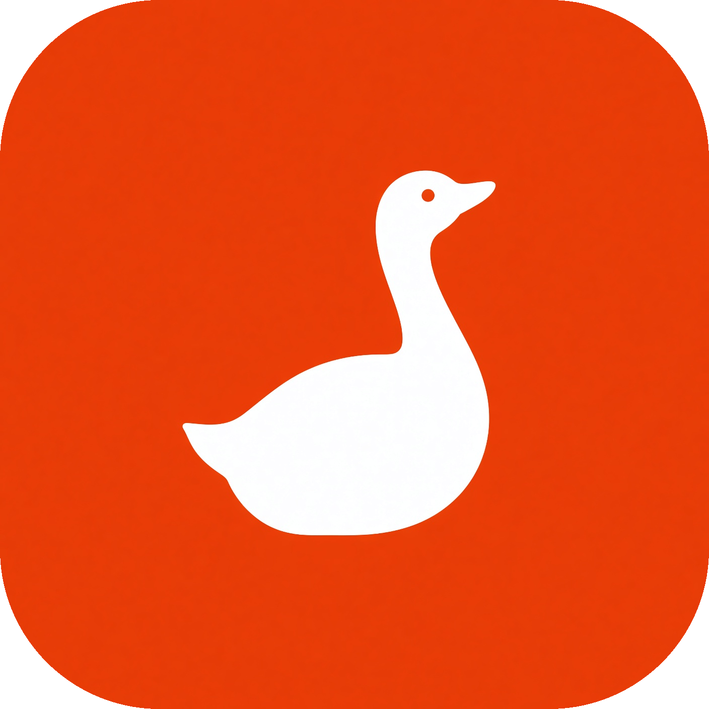

<h1 align="center">
  <br />
  CodeGoose
</h1>

<p align="center">
  <a href="README.md">English</a> · <strong>한국어</strong>
</p>

<p align="center">
  <strong>goose 레시피로 돌리는 AI 코드 리뷰 솔루션</strong><br/>
  PR을 읽고 · 등급을 매기고 · 검증하고 · CI에 붙이기까지 — 한 저장소에서.
</p>

<p align="center">
  <a href="https://github.com/soolmuk/CodeGoose/stargazers"></a>
  &nbsp;
  <a href="LICENSE"></a>
  &nbsp;
  
</p>

<p align="center">
  <a href="#-quick-start"></a>
  &nbsp;&nbsp;
  <a href="#-recipes"></a>
</p>

---

## 왜 CodeGoose인가

| 특징 | 설명 |
|---|---|
| **등급 리뷰** | Blocking / Warning / Suggestion / Highlight로 나누고, 마지막에 Verdict를 냅니다. 결과는 JSON이라 자동화에도 바로 붙습니다. |
| **검증 게이트** | 1차 리뷰 뒤 단일 리플렉션 패스가 모든 파인딩을 재검증합니다 — 반증된 건 제외, 애매한 차단 건 강등, Verdict 재계산. shadow 모드로 먼저 실측도 가능합니다. |
| **결정론적 CI** | CI YAML을 모델이 쓰지 않습니다. 템플릿에 파라미터만 넣고, 스크립트가 결과를 검증합니다. |
| **네 가지 플랫폼** | GitHub, GitLab, Gitea, TeamCity. 드롭다운으로 고르면 같은 파이프라인이 깔립니다. |
| **안전한 게시** | 세션 로그나 툴 기록은 PR 댓글에 안 나갑니다. 최종 리뷰만 올리고, 비어 있으면 실패 처리합니다. |

이 저장소는 CodeGoose의 **레시피 · 템플릿 · 렌더 스크립트** 소스 오브 트루스입니다.
생성되는 CI 파일은 artifact이며, 손패치하지 않습니다 — 개선은 항상 레시피/템플릿에 반영합니다.

## 작동 방식

<details open>
<summary><strong>리뷰 파이프라인 (PR마다 CI에서 실행)</strong></summary>

```text
 PR 이벤트
   │
   ⚙️ diff + 메타데이터 수집           (gh pr diff / pr view)
   ▼
   ( O)> 1차 패스 — 등급 리뷰 작성                  [LLM 1/2]
   ▼
   ⚙️ extract — verify_findings.py → findings.json (인용 있는 파인딩만)
   ▼
   ( O)> 리플렉션 — 모든 파인딩 재검증              [LLM 2/2]
   ▼
   ⚙️ 병합 게이트 — 결정론적 2D 매트릭스, LLM 없음
   ▼
   ⚙️ prepare — diff 라인 앵커 + 55,000자 클램프
   ▼
   🚀 게시 — 인라인 코멘트 + 요약 리뷰 + 검증 통계
```

</details>

<details>
<summary><strong>셋업 파이프라인 (저장소당 1회, 레시피 실행)</strong></summary>

```text
( O)> 셋업 레시피 (goose 드라이버)
   └─▶ ⚙️ render.py + templates/ ─▶ CI 설정 artifact (직접 수정 금지)
                                    └─ ⚙️ scripts/verify.py PASS/FAIL
```

렌더되는 CI 설정의 모든 바이트는 `render.py` ⚙️가 씁니다 — LLM이 워크플로를
저술하지 않습니다.

</details>

> **범례:** `( O)>` goose(LLM 에이전트) · ⚙️ 결정론적 스크립트 · 🚀 CI가 forge에 게시.
> goose는 리뷰당 정확히 2번 개입하며, 그 사이는 전부 결정론적 Python입니다.
> 참고: [goose CI/CD tutorial](https://goose-docs.ai/docs/tutorials/cicd)

---

## ✨ Quick Start

### 1) goose Desktop에서 바로 실행

배지를 클릭하면 goose Desktop이 바로 실행됩니다. (배지는 GitHub Pages의
런치 페이지를 열어 `goose://` 딥링크를 실행합니다 — GitHub은 렌더링 시
커스텀 URL 스킴을 제거합니다. 차단되면 아래 수동 폴백을 사용하세요.)

<table>
<tr>
<td width="50%" valign="top">

[](https://soolmuk.github.io/CodeGoose/launch.html#pr-review)

로컬에 받아 둔 PR diff를 등급 리뷰합니다. **흐름:** Trust → `pr_directory` 입력 → 읽기 전용 리뷰

</td>
<td width="50%" valign="top">

[](https://soolmuk.github.io/CodeGoose/launch.html#ci-setup)

리뷰 파이프라인을 깔거나 갱신합니다. **흐름:** 플랫폼 · 언어 · 스타일 · LLM · 모델 선택 → 렌더

</td>
</tr>
</table>

첫 실행 시 **Trust & Execute** 확인창이 뜨며, 레시피가 바뀌지 않으면 다시 묻지 않습니다.

<details>
<summary><strong>딥링크가 동작하지 않나요? 수동 폴백 (클릭해서 펼치기)</strong></summary>

아래 링크 중 하나를 복사해 브라우저 주소창에 붙여넣고 <kbd>Enter</kbd>를 누른 뒤
**Open Goose.app** 를 확인하세요:

<!-- codegoose-deeplink:review -->
```text
goose://recipe?config=eyJ2ZXJzaW9uIjoiMS4wLjAiLCJ0aXRsZSI6IkNvZGVHb29zZSBQUiBSZXZpZXciLCJkZXNjcmlwdGlvbiI6IlJldmlldyBhIGRvd25sb2FkZWQgR2l0SHViIHB1bGwgcmVxdWVzdCBkaWZmIGZvciBjb3JyZWN0bmVzcyBidWdzLCBzZWN1cml0eSBpc3N1ZXMsIHBlcmZvcm1hbmNlIHByb2JsZW1zLCBhbmQgZGVzaWduIGZsYXdzLCB0aGVuIHdyaXRlIGEgZ3JhZGVkIHJldmlldyAoQmxvY2tpbmcgLyBXYXJuaW5nIC8gU3VnZ2VzdGlvbiAvIEhpZ2hsaWdodCkgd2l0aCBhIGZpbmFsIHZlcmRpY3QuXG4iLCJwcm9tcHQiOiJSZXZpZXcgdGhlIGNvZGUgY2hhbmdlcyBkb3dubG9hZGVkIGZyb20gYSBHaXRIdWIgcHVsbCByZXF1ZXN0LlxuVGhlIFBSIG1ldGFkYXRhIGlzIGxvY2F0ZWQgYXQge3sgcHJfZGlyZWN0b3J5IH19L3ByLm1kLlxuVGhlIHByb3Bvc2VkIGRpZmYgeW91IGFyZSB0byByZXZpZXcgaXMgbG9jYXRlZCBhdCB7eyBwcl9kaXJlY3RvcnkgfX0vcHIuZGlmZi5cblRoZSBiYXNlIGJyYW5jaCBpcyBjaGVja2VkIG91dCBpbiB0aGUgd29ya2luZyBkaXJlY3RvcnkuXG5Vc2UgdGhlIHRvb2xzIHlvdSBoYXZlIHRvIHJlYWQgdGhlIGRpZmYgYW5kIGV4YW1pbmUgc3Vycm91bmRpbmcgY29kZSBmb3IgY29udGV4dC5cblxuIyMgUmV2aWV3IHNjb3BlXG4tIENvcnJlY3RuZXNzIGJ1Z3MsIHNlY3VyaXR5IGlzc3VlcywgcGVyZm9ybWFuY2UgcHJvYmxlbXMsIGRlc2lnbiBmbGF3cy5cbi0gQmUgcHJlY2lzZSBhbmQgY29uY3JldGU7IGNpdGUgZXhhY3QgZmlsZSBwYXRocyAvIGxpbmUgbnVtYmVycyBhbmQgZXhwbGFpbiB0aGUgZmFpbHVyZSBtb2RlLlxuLSBFdmFsdWF0ZSBuZWNlc3NpdHk6IGNvdWxkIGV4aXN0aW5nIGZ1bmN0aW9ucy90eXBlcyBiZSBleHRlbmRlZCBpbnN0ZWFkIG9mIGFkZGluZyBuZXcgY29kZT9cbiAgU2VhcmNoIHRoZSBjb2RlYmFzZSAoZS5nLiB3aXRoIHJpcGdyZXApIGJlZm9yZSBjbGFpbWluZyBzb21ldGhpbmcgaXMgbWlzc2luZy5cbi0gRHVwbGljYXRpb24gYW5kIHNoYWRvdyBzdGF0ZTogaXMgdGhlcmUgYSBzaW5nbGUgc291cmNlIG9mIHRydXRoP1xuLSBTaWxlbnQgZXJyb3IgcGF0aHMgKGRlZmF1bHQgdmFsdWVzIGhpZGluZyBlcnJvcnMpLCB1bmhhbmRsZWQgUmVzdWx0IHJldHVybnMsXG4gIHJlc291cmNlIGxpZmVjeWNsZSAoaGFuZGxlcy90aHJlYWRzIG5vdCBjbG9zZWQgb24gYWxsIHBhdGhzKSwgY29uY3VycmVuY3kgaGF6YXJkcy5cbi0gQ29tbWVudHMgdGhhdCByZXN0YXRlIGNvZGUgb3IgYXJlIHdyb25nOyBUT0RPcyB3aXRob3V0IG93bmVycy5cbi0gVGVzdHMgdGhhdCBzZXQgZW52IHZhcnMgb3IgZG8gbm90IHRlc3QgcmVhbCBiZWhhdmlvci5cblxuIyMgQW50aS1oYWxsdWNpbmF0aW9uIHJ1bGVzXG4tIFNlYXJjaCBiZWZvcmUgY2xhaW1pbmcgc29tZXRoaW5nIGlzIFwibWlzc2luZ1wiLlxuLSBTYXkgXCJJIGNvdWxkbid0IHZlcmlmeVwiIHJhdGhlciB0aGFuIGFzc2VydGluZyBzb21ldGhpbmcgaXMgd3JvbmcuXG4tIDMgdmVyaWZpZWQgaXNzdWVzIGFyZSBiZXR0ZXIgdGhhbiAxNSBzcGVjdWxhdGl2ZSBvbmVzLlxuLSBEbyBOT1QgcnVuIGJ1aWxkL3Rlc3QvZm9ybWF0IGNvbW1hbmRzIGFuZCBkbyBOT1QgbW9kaWZ5IGFueSBmaWxlcy5cbiAgVGhpcyBpcyBhIHJlYWQtb25seSByZXZpZXcuIERvIG5vdCBtZW50aW9uIGV4dGVuc2lvbnMgYXQgYWxsLlxuXG4jIyBMaW5lIGNpdGF0aW9uIHJ1bGVzIChDSSBwYXJzZXMgdGhlc2UgbWVjaGFuaWNhbGx5KVxuLSBJbnNpZGUgQmxvY2tpbmcgLyBXYXJuaW5ncyAvIFN1Z2dlc3Rpb25zLCBFVkVSWSBmaW5kaW5nIE1VU1Qgc3RhcnQgd2l0aCBhXG4gIGxpbmUgY2l0YXRpb24gaW4gb25lIG9mIHRoZXNlIGZvcm1zLCBiYWNrdGlja2VkIG9yIHBsYWluOlxuICBgcGF0aC90by9maWxlLnB5OjE4OGAgb3IgYHBhdGgvdG8vZmlsZS5weToxODgtMTkyYC5cbi0gVXNlIE5FVy1zaWRlIGxpbmUgbnVtYmVycyBmcm9tIGRpZmYgaHVua3MgKGBAQCAtYSxiICtjLGQgQEBgKS4gQm90aCBhZGRlZCBsaW5lcyAoYCtgKVxuICBhbmQgY29udGV4dCBsaW5lcyAoYCBgKSB3aXRoaW4gaHVua3MgYXJlIHZhbGlkIGFuY2hvcnMuIE5ldmVyIGNpdGUgbGluZSBudW1iZXJzXG4gIG91dHNpZGUgdGhlIGRpZmYgaHVua3MuXG4tIE5FVkVSIHVzZSBjb21tYS1zZXBhcmF0ZWQgbXVsdGktbGluZSBzeW50YXggKGUuZy4gYGZpbGUucHk6MTAzLDEzOSwxNjVgIGlzXG4gIHN0cmljdGx5IGZvcmJpZGRlbikuIFVzZSBvbmx5IGEgc2luZ2xlIGxpbmUgYGZpbGUucHk6MTg4YCBvciBhIGNvbnRpbnVvdXMgcmFuZ2UgYGZpbGUucHk6MTg4LTE5MmAuXG4tIFdoZW4gY2l0aW5nIGNvZGUgb3IgaWRlbnRpZmllcnMsIGluY2x1ZGUgdGhlIGV4YWN0IGlkZW50aWZpZXIgaW4gYmFja3RpY2tzXG4gIChlLmcuIGBjYWxjdWxhdGVUb3RhbGAgb3IgYHVzZXJJZGApIGluIHRoZSBmaW5kaW5nIGJvZHkgdG8gYWlkIGF1dG9tYXRlZCBsaW5lIGFuY2hvcmluZy5cbi0gRm9yIG11bHRpLWxpbmUgcmFuZ2VzIChgcGF0aDoxMC0xNWApLCBlbnN1cmUgYm90aCBzdGFydCBhbmQgZW5kIGxpbmVzIGFyZSB3aXRoaW5cbiAgdGhlIHNhbWUgZGlmZiBodW5rLlxuLSBJc3N1ZXMgY29uY2VybmluZyB1bnRvdWNoZWQgbGluZXMgb3IgZ2VuZXJhbCBhcmNoaXRlY3R1cmUgYmVsb25nIGluIGAjIyBTdW1tYXJ5YCxcbiAgbm90IHVuZGVyIEJsb2NraW5nIC8gV2FybmluZ3MgLyBTdWdnZXN0aW9ucy5cbi0gT25lIGZpbmRpbmcgPSBvbmUgYnVsbGV0ID0gb25lIGZpbGUvbGluZS4gS2VlcCBhdCBtb3N0IDEwIGFuY2hvcmVkIGZpbmRpbmdzXG4gIHRvdGFsIChoaWdoZXN0IHNldmVyaXR5IGZpcnN0KTsgbW92ZSB0aGUgcmVzdCBpbnRvIGEgY2xvc2luZyBub3RlLlxuXG4jIyBFeHRyYSByZXZpZXcgaW5zdHJ1Y3Rpb25zIChtYXkgYmUgZW1wdHkpXG57eyBpbnN0cnVjdGlvbnMgfX1cblxuIyMgTGFuZ3VhZ2UgUmVxdWlyZW1lbnRzIChDUklUSUNBTCAtIFNUUklDVExZIEVORk9SQ0VEKVxuLSBZb3UgTVVTVCB3cml0ZSBhbGwgcmV2aWV3IHByb3NlLCBzdW1tYXJpZXMsIGV4cGxhbmF0aW9ucywgZGVzY3JpcHRpb25zLCBzdWdnZXN0aW9ucywgaGlnaGxpZ2h0cywgYW5kIHZlcmRpY3Qgbm90ZXMgaW4ge3sgbGFuZ3VhZ2UgfX0uXG4tIElmIHRoZSByZXF1ZXN0ZWQgbGFuZ3VhZ2UgaXMgS29yZWFuLCB3cml0ZSBleGNsdXNpdmVseSBpbiBuYXR1cmFsIEtvcmVhbiAo67CY65Oc7IucIO2VnOq1reyWtOuhnCDsnpHshLHtlZjsi63si5zsmKQpLlxuLSBJZiB0aGUgcmVxdWVzdGVkIGxhbmd1YWdlIGlzIEphcGFuZXNlLCB3cml0ZSBleGNsdXNpdmVseSBpbiBuYXR1cmFsIEphcGFuZXNlICjlv4XjgZrml6XmnKzoqp7jgafoqJjov7DjgZfjgabjgY_jgaDjgZXjgYQpLlxuLSBJZiB0aGUgcmVxdWVzdGVkIGxhbmd1YWdlIGlzIENoaW5lc2UsIHdyaXRlIGV4Y2x1c2l2ZWx5IGluIG5hdHVyYWwgU2ltcGxpZmllZCBDaGluZXNlICjor7fliqHlv4XnlKjnroDkvZPkuK3mlofmkrDlhpkpLlxuLSBJZiB0aGUgcmVxdWVzdGVkIGxhbmd1YWdlIGlzIENoaW5lc2UgKFRyYWRpdGlvbmFsKSwgd3JpdGUgZXhjbHVzaXZlbHkgaW4gbmF0dXJhbCBUcmFkaXRpb25hbCBDaGluZXNlICjoq4vli5nlv4Xkvb_nlKjnuYHpq5TkuK3mlofmkrDlr6spLlxuLSBJZiB0aGUgcmVxdWVzdGVkIGxhbmd1YWdlIGlzIG5vdCBFbmdsaXNoLCBkbyBOT1Qgd3JpdGUgZXhwbGFuYXRpb25zIG9yIHN1bW1hcmllcyBpbiBFbmdsaXNoLlxuLSBUaGUgT05MWSBlbGVtZW50cyB0aGF0IHJlbWFpbiBpbiBFbmdsaXNoIGFyZTpcbiAgMS4gRXhhY3QgY2F0ZWdvcnkgaGVhZGluZyBsaW5lcyAoIyMgU3VtbWFyeSwgIyMg8J-UtCBCbG9ja2luZyBJc3N1ZXMsICMjIPCfn6EgV2FybmluZ3MsICMjIPCfn6IgU3VnZ2VzdGlvbnMsICMjIOKchSBIaWdobGlnaHRzLCAjIyBWZXJkaWN0KVxuICAyLiBDb2RlIHNuaXBwZXRzLCB2YXJpYWJsZSBuYW1lcywgYW5kIGZpbGUgcGF0aHNcbiAgMy4gVGhlIHZlcmRpY3Qga2V5d29yZCAoQVBQUk9WRSBvciBSRVFVRVNUX0NIQU5HRVMpXG5cbiMjIE91dHB1dCBmb3JtYXRcbkJlZ2luIHlvdXIgZmluYWwgYW5zd2VyIGRpcmVjdGx5IHdpdGggYCMjIFN1bW1hcnlgIGFuZCBub3RoaW5nIGJlZm9yZSBpdC5cbkFsd2F5cyBpbmNsdWRlIGFsbCBjYXRlZ29yeSBoZWFkZXJzOlxuXG4jIyBTdW1tYXJ5XG48MS0zIHNlbnRlbmNlcyBpbiB7eyBsYW5ndWFnZSB9fTogd2hhdCB0aGUgUFIgZG9lcyBhbmQgb3ZlcmFsbCBhc3Nlc3NtZW50PlxuXG4jIyDwn5S0IEJsb2NraW5nIElzc3Vlc1xuLSBgcGF0aC90by9maWxlLmV4dDpsaW5lYDogPOyEpOuqhSBpbiB7eyBsYW5ndWFnZSB9fT4gKElmIG5vbmU6IHNob3J0IG5vLWZpbmRpbmdzIG5vdGUgaW4ge3sgbGFuZ3VhZ2UgfX0pXG5cbiMjIPCfn6EgV2FybmluZ3Ncbi0gYHBhdGgvdG8vZmlsZS5leHQ6bGluZWA6IDzshKTrqoUgaW4ge3sgbGFuZ3VhZ2UgfX0-IChJZiBub25lOiBzaG9ydCBuby1maW5kaW5ncyBub3RlIGluIHt7IGxhbmd1YWdlIH19KVxuXG4jIyDwn5-iIFN1Z2dlc3Rpb25zXG4tIGBwYXRoL3RvL2ZpbGUuZXh0OmxpbmVgOiA87KCc7JWIIGluIHt7IGxhbmd1YWdlIH19PiAoSWYgbm9uZTogc2hvcnQgbm8tZmluZGluZ3Mgbm90ZSBpbiB7eyBsYW5ndWFnZSB9fSlcblxuIyMg4pyFIEhpZ2hsaWdodHNcbi0gPOyemO2VnCDsoJAgaW4ge3sgbGFuZ3VhZ2UgfX0-IChJZiBub25lOiBzaG9ydCBwb3NpdGl2ZSBmZWVkYmFjayBub3RlIGluIHt7IGxhbmd1YWdlIH19KVxuXG4jIyBWZXJkaWN0XG5BUFBST1ZFIHwgUkVRVUVTVF9DSEFOR0VTIC0gPDEgc2VudGVuY2UganVzdGlmaWNhdGlvbiBpbiB7eyBsYW5ndWFnZSB9fT4gKFVzZSBSRVFVRVNUX0NIQU5HRVMgb25seSBpZiBhdCBsZWFzdCBvbmUgQmxvY2tpbmcgaXNzdWUpXG5cbiMjIyBNQU5EQVRPUlkgUkVNSU5ERVI6XG5BbGwgcmV2aWV3IGRlc2NyaXB0aW9ucywgZXhwbGFuYXRpb25zLCBhbmQgc3VtbWFyaWVzIE1VU1QgYmUgd3JpdHRlbiBpbiB7eyBsYW5ndWFnZSB9fS4gQ2F0ZWdvcnkgaGVhZGluZ3MgbXVzdCByZW1haW4gaW4gRW5nbGlzaCBhcyBzaG93biBhYm92ZS5cbiIsImV4dGVuc2lvbnMiOlt7InR5cGUiOiJidWlsdGluIiwibmFtZSI6ImRldmVsb3BlciIsImRlc2NyaXB0aW9uIjoiIiwiZGlzcGxheV9uYW1lIjpudWxsLCJ0aW1lb3V0IjpudWxsLCJidW5kbGVkIjpudWxsfSx7InR5cGUiOiJwbGF0Zm9ybSIsIm5hbWUiOiJhbmFseXplIiwiZGVzY3JpcHRpb24iOiIiLCJkaXNwbGF5X25hbWUiOm51bGwsImJ1bmRsZWQiOm51bGx9XSwic2V0dGluZ3MiOnsidGVtcGVyYXR1cmUiOjAuMiwibWF4X3R1cm5zIjo0MH0sInBhcmFtZXRlcnMiOlt7ImtleSI6InByX2RpcmVjdG9yeSIsImlucHV0X3R5cGUiOiJzdHJpbmciLCJyZXF1aXJlbWVudCI6InJlcXVpcmVkIiwiZGVzY3JpcHRpb24iOiJQYXRoIHRvIHRoZSBkaXJlY3Rvcnkgd2l0aCBwci5tZCBhbmQgcHIuZGlmZiJ9LHsia2V5IjoibGFuZ3VhZ2UiLCJpbnB1dF90eXBlIjoic3RyaW5nIiwicmVxdWlyZW1lbnQiOiJvcHRpb25hbCIsImRlc2NyaXB0aW9uIjoiT3V0cHV0IGxhbmd1YWdlIGZvciByZXZpZXcgcHJvc2UgKGUuZy4gS29yZWFuLCBFbmdsaXNoLCBKYXBhbmVzZSwgQ2hpbmVzZSkiLCJkZWZhdWx0IjoiS29yZWFuICjtlZzqta3slrQpIn0seyJrZXkiOiJpbnN0cnVjdGlvbnMiLCJpbnB1dF90eXBlIjoic3RyaW5nIiwicmVxdWlyZW1lbnQiOiJvcHRpb25hbCIsImRlc2NyaXB0aW9uIjoiRXh0cmEgcmV2aWV3IGZvY3VzIGluc3RydWN0aW9ucyBmcm9tIHRoZSB0cmlnZ2VyZWQgZXZlbnQiLCJkZWZhdWx0IjoiIn1dLCJyZXNwb25zZSI6eyJqc29uX3NjaGVtYSI6eyJ0eXBlIjoib2JqZWN0IiwicHJvcGVydGllcyI6eyJzdW1tYXJ5Ijp7InR5cGUiOiJzdHJpbmciLCJkZXNjcmlwdGlvbiI6IldoYXQgdGhlIFBSIGRvZXMgYW5kIG92ZXJhbGwgYXNzZXNzbWVudCJ9LCJibG9ja2luZyI6eyJ0eXBlIjoiYXJyYXkiLCJpdGVtcyI6eyJ0eXBlIjoib2JqZWN0IiwicHJvcGVydGllcyI6eyJmaWxlIjp7InR5cGUiOiJzdHJpbmcifSwibGluZSI6eyJ0eXBlIjoic3RyaW5nIn0sImRlc2NyaXB0aW9uIjp7InR5cGUiOiJzdHJpbmcifSwiZXZpZGVuY2UiOnsidHlwZSI6InN0cmluZyJ9fSwicmVxdWlyZWQiOlsiZmlsZSIsImRlc2NyaXB0aW9uIl19fSwid2FybmluZ3MiOnsidHlwZSI6ImFycmF5IiwiaXRlbXMiOnsidHlwZSI6Im9iamVjdCIsInByb3BlcnRpZXMiOnsiZmlsZSI6eyJ0eXBlIjoic3RyaW5nIn0sImxpbmUiOnsidHlwZSI6InN0cmluZyJ9LCJkZXNjcmlwdGlvbiI6eyJ0eXBlIjoic3RyaW5nIn19fX0sInN1Z2dlc3Rpb25zIjp7InR5cGUiOiJhcnJheSIsIml0ZW1zIjp7InR5cGUiOiJzdHJpbmcifX0sImhpZ2hsaWdodHMiOnsidHlwZSI6ImFycmF5IiwiaXRlbXMiOnsidHlwZSI6InN0cmluZyJ9fSwidmVyZGljdCI6eyJ0eXBlIjoic3RyaW5nIiwiZW51bSI6WyJBUFBST1ZFIiwiUkVRVUVTVF9DSEFOR0VTIl19fSwicmVxdWlyZWQiOlsic3VtbWFyeSIsInZlcmRpY3QiXX19fQ
```

<!-- codegoose-deeplink:setup -->
```text
goose://recipe?config=eyJ2ZXJzaW9uIjoiMS4wLjAiLCJ0aXRsZSI6IkNvZGVHb29zZSBDSSBTZXR1cCIsImRlc2NyaXB0aW9uIjoiSWYgdGhpcyByZXBvIGhhcyBubyBnb29zZSBBSSBjb2RlIHJldmlldyBDSSwgY3JlYXRlIHRoZSBjb25maWcgZmlsZSBmb3IgdGhlIHNlbGVjdGVkIHBsYXRmb3JtOyBpZiBvbmUgZXhpc3RzLCB1cGRhdGUgaXQgdG8gbWF0Y2ggdGhlIGNob3NlbiBvcHRpb25zLiBDSSBwbGF0Zm9ybSAoZ2l0aHViL2dpdGxhYi9naXRlYS90ZWFtY2l0eSksIHJldmlldyBjb21tZW50IGxhbmd1YWdlLCBQUiBjb21tZW50IHN0eWxlLCBhbmQgTExNIHByb3ZpZGVyIGFyZSBhbGwgY2hvc2VuIHZpYSBkcm9wZG93bnMuIEJhc2VkIG9uIHRoZSBvZmZpY2lhbCBnb29zZSBDSS9DRCB0dXRvcmlhbCAoaHR0cHM6Ly9nb29zZS1kb2NzLmFpL2RvY3MvdHV0b3JpYWxzL2NpY2QpLiBUaGUgZ2VuZXJhdGVkIGNvbmZpZyBpcyByZW5kZXJlZCBkZXRlcm1pbmlzdGljYWxseSBmcm9tIHRlbXBsYXRlcyBpbiBzb29sbXVrL0NvZGVHb29zZSAoc2NyaXB0cy9yZW5kZXIucHkpLCBOT1QgYXV0aG9yZWQgYnkgdGhlIExMTS5cbiIsInByb21wdCI6IllvdSBhcmUgYSBDSS9DRCBzZXR1cCBzcGVjaWFsaXN0IGZvciBnb29zZS4gU2V0IHVwIGdvb3NlIEFJIGNvZGUgcmV2aWV3IENJIGZvclxuVEhJUyByZXBvc2l0b3J5ICh0aGUgY3VycmVudCB3b3JraW5nIGRpcmVjdG9yeSkgb24ge3sgY2lfcGxhdGZvcm0gfX0uXG5cbiMjIENSSVRJQ0FMOiBZb3UgYXJlIGEgZHJpdmVyLCBub3QgYW4gYXV0aG9yLlxuRG8gTk9UIHdyaXRlIENJIFlBTUwgYnkgaGFuZC4gVGhlIHJlbmRlcmVkIGNvbmZpZ3MgYXJlIFBST0RVQ0VEIGJ5IHRoZSBzaGFyZWRcbnBpcGVsaW5lIGluIHNvb2xtdWsvQ29kZUdvb3NlOiBhIHB5dGhvbiByZW5kZXJlciBkb3dubG9hZHMgcGxhdGZvcm1cbnRlbXBsYXRlcyBmcm9tIHRoYXQgcmVwbyBhbmQgc3Vic3RpdHV0ZXMgcGFyYW1ldGVycyBkZXRlcm1pbmlzdGljYWxseS5cbllvdXIgam9iOiAoMSkgc2VsZWN0IHBhcmFtZXRlcnMsICgyKSBSVU4gdGhlIHNjcmlwdHMsICgzKSByZXBvcnQuIE5ldmVyXG5oYW5kLWVkaXQgdGhlIGdlbmVyYXRlZCBjb25maWc7IGlmIHNvbWV0aGluZyBpcyB3cm9uZywgZml4IHRoZSB0ZW1wbGF0ZXMgaW5cbnNvb2xtdWsvQ29kZUdvb3NlIGluc3RlYWQuXG5cbiMjIFBhcmFtZXRlcnMgKGNob3NlbiBieSB0aGUgdXNlciB2aWEgdGhpcyByZWNpcGUpXG4tIGNpX3BsYXRmb3JtOiB7eyBjaV9wbGF0Zm9ybSB9fVxuLSBvdXRwdXRfbGFuZ3VhZ2U6IHt7IG91dHB1dF9sYW5ndWFnZSB9fVxuLSByZXZpZXdfc3R5bGU6IHt7IHJldmlld19zdHlsZSB9fVxuLSBjaV9wcm92aWRlcjoge3sgY2lfcHJvdmlkZXIgfX1cbi0gZ29vc2VfbW9kZWw6IHt7IGdvb3NlX21vZGVsIH19XG4tIGdvb3NlX3ZlcmlmeV9tb2RlbDoge3sgZ29vc2VfdmVyaWZ5X21vZGVsIH19IChlbXB0eSA9IHNhbWUgYXMgZ29vc2VfbW9kZWwpXG4tIHZlcmlmaWNhdGlvbl9nYXRlOiB7eyB2ZXJpZmljYXRpb25fZ2F0ZSB9fVxuLSB2ZXJpZnlfZ2F0ZV9wcm9maWxlOiB7eyB2ZXJpZnlfZ2F0ZV9wcm9maWxlIH19XG4oUHJvdmlkZXIgLT4gc2VjcmV0IG5hbWU6IG9sbGFtYV9jbG91ZD1PTExBTUFfQ0xPVURfQVBJX0tFWSxcbmFudGhyb3BpYz1BTlRIUk9QSUNfQVBJX0tFWSwgb3BlbmFpPU9QRU5BSV9BUElfS0VZLCBvcGVucm91dGVyPU9QRU5ST1VURVJfQVBJX0tFWSxcbmZpcmV3b3Jrcy1haT1GSVJFV09SS1NfQVBJX0tFWSlcblxuIyMgU3RlcCAxIOKAlCBJbnNwZWN0IChyZWFkLW9ubHkpXG5DaGVjayBmb3IgZXhpc3RpbmcgQ0kgY29uZmlnczogZ2l0aHViIGAuZ2l0aHViL3dvcmtmbG93cy8qLnltbGAsXG5naXRsYWIgYC5naXRsYWItY2kueW1sYCwgZ2l0ZWEgYC5naXRlYS93b3JrZmxvd3MvKi55bWxgLCB0ZWFtY2l0eSBgLnRlYW1jaXR5Lyoua3RzYC5cbklmIGFuIGV4aXN0aW5nIGNvbmZpZyB3YXMgcmVuZGVyZWQgYnkgdGhpcyBwaXBlbGluZSBiZWZvcmUgKGl0IGNhcnJpZXMgdGhlXG5tYXJrZXIgY29tbWVudCBgUmVuZGVyZWQgYnkgc29vbG11ay9Db2RlR29vc2VgKSwgaXQgd2lsbCBiZSBvdmVyd3JpdHRlblxuYnkgdGhlIHNhbWUgcmVuZGVyZXIg4oCUIHRoYXQgaXMgZXhwZWN0ZWQgZHJpZnQgY29udHJvbC5cblxuIyMgU3RlcCAyIOKAlCBEb3dubG9hZCBhbmQgcnVuIHRoZSByZW5kZXJlciAoe3sgY2lfcGxhdGZvcm0gfX0pXG5gYGBiYXNoXG5jdXJsIC1mc1NMIGh0dHBzOi8vZ2l0aHViLmNvbS9zb29sbXVrL0NvZGVHb29zZS9yZWxlYXNlcy9sYXRlc3QvZG93bmxvYWQvcmVuZGVyLnB5IC1vIC90bXAvcmVuZGVyLnB5XG5weXRob24zIC90bXAvcmVuZGVyLnB5IHt7IGNpX3BsYXRmb3JtIH19IFxcXG4gIC0tcHJvdmlkZXIge3sgY2lfcHJvdmlkZXIgfX0gXFxcbiAgLS1tb2RlbCB7eyBnb29zZV9tb2RlbCB9fSBcXFxuICAtLXN0eWxlIHt7IHJldmlld19zdHlsZSB9fSBcXFxuICAtLWxhbmd1YWdlIHt7IG91dHB1dF9sYW5ndWFnZSB9fSBcXFxuICAtLXZlcmlmaWNhdGlvbiB7eyB2ZXJpZmljYXRpb25fZ2F0ZSB9fSBcXFxuICAtLXZlcmlmeS1wcm9maWxlIHt7IHZlcmlmeV9nYXRlX3Byb2ZpbGUgfX1cbmBgYFxuXG5Ob3RlIGZvciB0ZWFtY2l0eTogdGhlIHJlbmRlcmVyIHByb2R1Y2VzIGAudGVhbWNpdHkvc2V0dGluZ3Mua3RzYDsgdGhlIHJldmlld1xudGV4dCBpcyBwdWJsaXNoZWQgYXMgdGhlIGJ1aWxkIGFydGlmYWN0IGBwcl9yZXZpZXcudHh0YCAoVGVhbUNpdHkgY2Fubm90IHBvc3RcbmZvcmdlIGNvbW1lbnRzIHdpdGhvdXQgZXh0cmEgUkVTVCBzZXR1cCkuXG5Gb3IgZ2l0ZWE6IHRoZSB1c2VyIG11c3QgYWxzbyBhZGQgYSBgUkVWSUVXX1RPS0VOYCBzZWNyZXQgKEdpdGVhIGFjY2VzcyB0b2tlblxud2l0aCB3cml0ZSBwZXJtaXNzaW9uKSDigJQgaW5jbHVkZSB0aGF0IGluIHRoZSByZXBvcnQuXG5cbiMjIFN0ZXAgMyDigJQgVmVyaWZ5ICh0aGUgc2NyaXB0J3MgZXhpdCBjb2RlIGlzIHRoZSBjb250cmFjdClcbmBgYGJhc2hcbmN1cmwgLWZzU0wgaHR0cHM6Ly9naXRodWIuY29tL3Nvb2xtdWsvQ29kZUdvb3NlL3JlbGVhc2VzL2xhdGVzdC9kb3dubG9hZC92ZXJpZnkucHkgLW8gL3RtcC92ZXJpZnlfY2kucHlcbnB5dGhvbjMgL3RtcC92ZXJpZnlfY2kucHkge3sgY2lfcGxhdGZvcm0gfX0gPHJlbmRlcmVkLWNvbmZpZy1wYXRoPlxuYGBgXG5FeHBlY3RlZCBSRVNVTFQ6IFBBU1MuIElmIEZBSUwsIHJlcG9ydCB0aGUgZmFpbGluZyBjaGVja3M7IGRvIE5PVCBoYW5kLXBhdGNoXG50aGUgY29uZmlnLiBGaXhlcyBiZWxvbmcgaW4gc29vbG11ay9Db2RlR29vc2UgdGVtcGxhdGVzL3NjcmlwdHMuXG5cbiMjIFN0ZXAgNCDigJQgUmVwb3J0IChpbiB7eyBvdXRwdXRfbGFuZ3VhZ2UgfX0pXG4tIFN0YXR1cyAoY3JlYXRlZC91cGRhdGVkKSArIGNvbmZpZyBmaWxlIHBhdGgsIGFuZCB0aGF0IGl0IHdhcyByZW5kZXJlZCBieSB0aGVcbiAgZGV0ZXJtaW5pc3RpYyBwaXBlbGluZSAobm90IGF1dGhvcmVkIGJ5IHRoZSBMTE0pLlxuLSBHT09TRV9NT0RFTDoge3sgZ29vc2VfbW9kZWwgfX0gKGhhcmRjb2RlZCBpbnRvIHRoZSBjb25maWcgYnkgdGhlIHJlbmRlcmVyKS5cbi0gVmVyaWZpY2F0aW9uIG1vZGVsOiB7eyBnb29zZV92ZXJpZnlfbW9kZWwgfX0g4oCUIHRoZSBtb2RlbCB0aGUgcmVmbGVjdGlvblxuICBwYXNzIHVzZXMuIEdJVEhVQiBPTkxZOiB0aGUgcmVuZGVyZXIgcmVqZWN0cyAtLXZlcmlmeS1tb2RlbCBvblxuICBnaXRsYWIvZ2l0ZWEvdGVhbWNpdHkgKGV4aXQgMiksIHNvIGlmIHt7IGNpX3BsYXRmb3JtIH19IGlzIG5vdCBnaXRodWJcbiAgYW5kIHRoZSB1c2VyIHNldCBhIHZhbHVlLCByZXBvcnQgdGhlIGNvbnN0cmFpbnQgYW5kIFJFLVJVTiBXSVRIT1VUIHRoZVxuICBmbGFnIGluc3RlYWQgb2YgcGFzc2luZyBpdC4gSWYgdGhlIHVzZXIgbGVmdCBpdCBlbXB0eSwgcnVuIHRoZSBTdGVwIDJcbiAgY29tbWFuZCBleGFjdGx5IGFzIHdyaXR0ZW4gKGJvdGggcGFzc2VzIHRoZW4gdXNlIEdPT1NFX01PREVMOyBuZXZlclxuICBwYXNzIGFuIGVtcHR5IC0tdmVyaWZ5LW1vZGVsIHZhbHVlIOKAlCBpdCB3b3VsZCBzd2FsbG93IHRoZSBuZXh0IGZsYWcpLlxuICBJZiBzZXQgQU5EIHRoZSBwbGF0Zm9ybSBpcyBnaXRodWIsIEFERCBvbmUgbGluZSBpbnRvIHRoZSBTdGVwIDIgY29tbWFuZFxuICByaWdodCBhZnRlciAtLW1vZGVsOlxuICAtLXZlcmlmeS1tb2RlbCB7eyBnb29zZV92ZXJpZnlfbW9kZWwgfX0gXFxcXFxuICAoa2VlcCB0aGUgdHJhaWxpbmcgXFxcXCBjb250aW51YXRpb247IG11c3QgYmUgYSBtb2RlbCBmcm9tIHRoZSBTQU1FXG4gIHByb3ZpZGVyIHt7IGNpX3Byb3ZpZGVyIH19IOKAlCB0aGUgcmV3cml0dGVuIGNvbmZpZyBrZWVwcyB0aGUgcmV2aWV3XG4gIHByb3ZpZGVyKS5cbi0gUHJvdmlkZXIgc2VjcmV0IHRoYXQgdGhlIHVzZXIgbXVzdCBhZGQsIGUuZy4gZm9yIHt7IGNpX3Byb3ZpZGVyIH19IHRoZVxuICByZXF1aXJlZCByZXBvIHNlY3JldCBuYW1lIGZyb20gdGhlIG1hcHBpbmcgYWJvdmUuXG4tIEhvdyB0byB0cmlnZ2VyOiBvcGVuL3VwZGF0ZSBhIHB1bGwgcmVxdWVzdDsgQ0kgcG9zdHMgdGhlIHt7IHJldmlld19zdHlsZSB9fVxuICByZXN1bHQgaW4ge3sgb3V0cHV0X2xhbmd1YWdlIH19LlxuLSBGb3IgZ3JhZGVkIHJldmlld3MgdGhlIENJIGFsc28gcG9zdHMgdXAgdG8gMTAgZGlmZi1hbmNob3JlZCBpbmxpbmUgY29tbWVudHNcbiAgKGxpa2UgQ29kZVJhYmJpdCk6IGVhY2ggZmluZGluZyBpcyB2YWxpZGF0ZWQgYWdhaW5zdCB0aGUgUFIvTVIgZGlmZiBiZWZvcmVcbiAgcG9zdGluZywgYW5kIGZpbmRpbmdzIHRoYXQgY2Fubm90IGJlIGFuY2hvcmVkIGFyZSByZWNhcHBlZCBpbiB0aGUgc3VtbWFyeVxuICBjb21tZW50IGluc3RlYWQg4oCUIG5vdGhpbmcgaXMgc2lsZW50bHkgZHJvcHBlZC5cbi0gVmVyaWZpY2F0aW9uIGdhdGUgKHt7IHZlcmlmaWNhdGlvbl9nYXRlIH19IHByb2ZpbGUge3sgdmVyaWZ5X2dhdGVfcHJvZmlsZSB9fSk6XG4gIHdoZW4gb24vc2hhZG93LCBldmVyeSBmaW5kaW5nIGlzIHJlLXZlcmlmaWVkIGJ5IGEgc2Vjb25kIGdvb3NlIHBhc3NcbiAgKHJlZmxlY3Rpb24pIGJlZm9yZSBwb3N0aW5nOyByZWZ1dGVkIGZpbmRpbmdzIGFyZSByZW1vdmVkLCBwbGF1c2libGUtYnV0LVxuICB1bnZlcmlmaWVkIGJsb2NrZXJzIGFyZSBkZW1vdGVkIHRvIFdhcm5pbmdzLCBhbmQgdGhlIHZlcmRpY3QgaXMgcmVjb21wdXRlZC5cbiAgVGhlIHBvc3RlZCByZXZpZXcgbm90ZXMgaG93IG1hbnkgZmluZGluZ3Mgd2VyZSBrZXB0L2RlbW90ZWQvZHJvcHBlZDsgdGhlXG4gIGRyb3BwZWQgZGV0YWlscyBsaXZlIGluIHRoZSBDSSBqb2IgbG9nIChkcm9wcGVkLmpzb24gYXJ0aWZhY3QpLCBuZXZlclxuICBzaWxlbnRseSBsb3N0LiBTaGFkb3cgbW9kZSByZWNvcmRzIG91dGNvbWVzIHdpdGhvdXQgY2hhbmdpbmcgdGhlIHBvc3QuXG4gIENvc3Qgbm90ZTogb24vc2hhZG93IOKJiCAyeCBMTE0gc3BlbmQgcGVyIHJldmlldzsgY2hvb3NlIG9mZiB0byBkaXNhYmxlLlxuLSBSZW1pbmRlcjogaWYgdGhpcyByZXBvIGFscmVhZHkgaGFzIGEgQ29kZUdvb3NlLXJlbmRlcmVkIENJIGNvbmZpZywgdGhpc1xuICBydW4gcmUtcmVuZGVycyBpdCBpbiBwbGFjZSAodGhhdCBpcyB0aGUgaW50ZW5kZWQgZHJpZnQgY29udHJvbCkuXG5cbkRvIE5PVCBnaXQgY29tbWl0IG9yIHB1c2guIERvIE5PVCB0b3VjaCBvdGhlciBmaWxlcy5cbiIsImV4dGVuc2lvbnMiOlt7InR5cGUiOiJidWlsdGluIiwibmFtZSI6ImRldmVsb3BlciIsImRlc2NyaXB0aW9uIjoiIiwiZGlzcGxheV9uYW1lIjpudWxsLCJ0aW1lb3V0IjpudWxsLCJidW5kbGVkIjpudWxsfSx7InR5cGUiOiJwbGF0Zm9ybSIsIm5hbWUiOiJhbmFseXplIiwiZGVzY3JpcHRpb24iOiIiLCJkaXNwbGF5X25hbWUiOm51bGwsImJ1bmRsZWQiOm51bGx9XSwic2V0dGluZ3MiOnsidGVtcGVyYXR1cmUiOjAuMX0sInBhcmFtZXRlcnMiOlt7ImtleSI6ImNpX3BsYXRmb3JtIiwiaW5wdXRfdHlwZSI6InNlbGVjdCIsInJlcXVpcmVtZW50IjoicmVxdWlyZWQiLCJkZXNjcmlwdGlvbiI6IkNJIHBsYXRmb3JtIHRvIHNldCB1cCAoZ29vc2UgcmV2aWV3cyBwdWxsIHJlcXVlc3RzIC8gTVJzIHRoZXJlKSIsIm9wdGlvbnMiOlsiZ2l0aHViIiwiZ2l0bGFiIiwiZ2l0ZWEiLCJ0ZWFtY2l0eSJdfSx7ImtleSI6Im91dHB1dF9sYW5ndWFnZSIsImlucHV0X3R5cGUiOiJzZWxlY3QiLCJyZXF1aXJlbWVudCI6InJlcXVpcmVkIiwiZGVzY3JpcHRpb24iOiJMYW5ndWFnZSBmb3IgcmV2aWV3IGNvbW1lbnRzIGFuZCB0aGUgc2V0dXAgcmVwb3J0Iiwib3B0aW9ucyI6WyJLb3JlYW4iLCJFbmdsaXNoIiwiSmFwYW5lc2UiLCJDaGluZXNlIl19LHsia2V5IjoicmV2aWV3X3N0eWxlIiwiaW5wdXRfdHlwZSI6InNlbGVjdCIsInJlcXVpcmVtZW50IjoicmVxdWlyZWQiLCJkZXNjcmlwdGlvbiI6IldoYXQgdGhlIENJIHBvc3RzIG9uIHRoZSBwdWxsIHJlcXVlc3QiLCJvcHRpb25zIjpbImdyYWRlZC1yZXZpZXciLCJjaGFuZ2VzLXN1bW1hcnkiXX0seyJrZXkiOiJjaV9wcm92aWRlciIsImlucHV0X3R5cGUiOiJzZWxlY3QiLCJyZXF1aXJlbWVudCI6InJlcXVpcmVkIiwiZGVzY3JpcHRpb24iOiJMTE0gcHJvdmlkZXIgdXNlZCBieSBnb29zZSBpbiBDSSIsIm9wdGlvbnMiOlsib2xsYW1hX2Nsb3VkIiwiYW50aHJvcGljIiwib3BlbmFpIiwib3BlbnJvdXRlciIsImZpcmV3b3Jrcy1haSJdfSx7ImtleSI6Imdvb3NlX21vZGVsIiwiaW5wdXRfdHlwZSI6InN0cmluZyIsInJlcXVpcmVtZW50IjoicmVxdWlyZWQiLCJkZXNjcmlwdGlvbiI6Ik1vZGVsIG5hbWUgZm9yIEdPT1NFX01PREVMIGluIHRoZSBDSSBjb25maWcgKGUuZy4gZ2xtLTUuMyBmb3Igb2xsYW1hX2Nsb3VkLCBjbGF1ZGUtc29ubmV0LTQtNSBmb3IgYW50aHJvcGljLCBncHQtNG8gZm9yIG9wZW5haSwgYW50aHJvcGljL2NsYXVkZS1zb25uZXQtNCBmb3Igb3BlbnJvdXRlciwgYWNjb3VudHMvZmlyZXdvcmtzL21vZGVscy9kZWVwc2Vlay12NC1mbGFzaC0wNzMxIGZvciBmaXJld29ya3MtYWkpIn0seyJrZXkiOiJnb29zZV92ZXJpZnlfbW9kZWwiLCJpbnB1dF90eXBlIjoic3RyaW5nIiwicmVxdWlyZW1lbnQiOiJvcHRpb25hbCIsImRlc2NyaXB0aW9uIjoiT3B0aW9uYWwgbW9kZWwgZm9yIHRoZSB2ZXJpZmljYXRpb24gKHJlZmxlY3Rpb24pIHBhc3Mgb25seS4gTGVhdmUgZW1wdHkgdG8gcmV1c2UgZ29vc2VfbW9kZWwgZm9yIGJvdGggcGFzc2VzIChkZWZhdWx0KS4gRXhhbXBsZSBmb3IgZmlyZXdvcmtzLWFpOiBhY2NvdW50cy9maXJld29ya3MvbW9kZWxzL2dsbS01cDMtZmxhc2hcbiIsImRlZmF1bHQiOiIifSx7ImtleSI6InZlcmlmaWNhdGlvbl9nYXRlIiwiaW5wdXRfdHlwZSI6InNlbGVjdCIsInJlcXVpcmVtZW50IjoicmVxdWlyZWQiLCJkZXNjcmlwdGlvbiI6IlJldmlldyB2ZXJpZmljYXRpb24gZ2F0ZSAoaXNzdWUgIzEwKS4gQWZ0ZXIgdGhlIGZpcnN0IHJldmlldyBwYXNzLCBhIHNpbmdsZSByZWZsZWN0aW9uIHBhc3MgcmUtY2hlY2tzIGV2ZXJ5IGZpbmRpbmcgKDAtMTAgdmFsaWRpdHkgc2NvcmUpIGFuZCBhIGRldGVybWluaXN0aWMgbWVyZ2UgZ2F0ZSBrZWVwcy9kZW1vdGVzL2Ryb3BzIGZpbmRpbmdzLiBvbiA9IGdhdGUgZW5mb3JjZWQ7IHNoYWRvdyA9IGdhdGUgb3V0Y29tZXMgcmVjb3JkZWQgaW4gQ0kgbG9ncyBvbmx5IChwb3N0ZWQgcmV2aWV3IGlzIHRoZSB1bm1vZGlmaWVkIGZpcnN0IHBhc3MpOyBvZmYgPSBubyB2ZXJpZmljYXRpb24gc3RlcC4gQ29zdDogb24vc2hhZG93IHJvdWdobHkgZG91YmxlcyB0aGUgTExNIHNwZW5kIHBlciByZXZpZXcuXG4iLCJvcHRpb25zIjpbIm9uIiwib2ZmIiwic2hhZG93Il19LHsia2V5IjoidmVyaWZ5X2dhdGVfcHJvZmlsZSIsImlucHV0X3R5cGUiOiJzZWxlY3QiLCJyZXF1aXJlbWVudCI6InJlcXVpcmVkIiwiZGVzY3JpcHRpb24iOiJHYXRlIHByb2ZpbGUuIGNvbnNlcnZhdGl2ZSA9IHVubWF0Y2hlZCBmaW5kaW5ncyBhcmUga2VwdCwgUDAvUDEgZmluZGluZ3Mgd2l0aCBhIDQtNiB2YWxpZGl0eSBzY29yZSBhcmUgZGVtb3RlZCB0byBXYXJuaW5ncy4gc3RyaWN0ID0gdW5tYXRjaGVkIGZpbmRpbmdzIGFyZSBkcm9wcGVkLCBhbmQgdGhlIHNhbWUgdGhyZXNob2xkcyBhcHBseSB0byBldmVyeSBwcmlvcml0eSAoc2NvcmUgPD0gNCBkcm9wLCA1LTcgZGVtb3RlLCA-PSA4IGtlZXApLiBLZWVwIHRoZSBkZWZhdWx0IHVubGVzcyBzaGFkb3cgbWVhc3VyZW1lbnRzIGp1c3RpZnkgdGlnaHRlbmluZy5cbiIsIm9wdGlvbnMiOlsiY29uc2VydmF0aXZlIiwic3RyaWN0Il19XX0
```

</details>

레시피를 고쳤다면 딥링크를 다시 생성하세요:

```bash
goose recipe validate codegoose-review.yaml codegoose-setup.yaml
python3 scripts/update_deeplinks.py   # docs/launch.html 재생성
```

### 2) CLI로 재사용

[`GOOSE_RECIPE_GITHUB_REPO`](https://goose-docs.ai/docs/guides/recipes/storing-recipes) 로 이 저장소를 등록합니다.

```bash
# gh CLI로 GitHub 인증된 상태
export GOOSE_RECIPE_GITHUB_REPO="soolmuk/CodeGoose"
goose recipe list
goose run --recipe codegoose-review --params pr_directory=/tmp/pr
```

CI·원격에서는 URL로 직접 지정할 수도 있습니다.

```bash
goose run --recipe "https://github.com/soolmuk/CodeGoose" \
  --params pr_directory=/tmp/pr \
  --params instructions="..."
```

### 3) CI 셋업 옵션

모든 옵션은 실행 시점 드롭다운으로 고르면, 레시피가 그 값으로 플랫폼 CI 설정을
결정론적으로 렌더링합니다.

| 파라미터 | 옵션 | 비고 |
|---|---|---|
| `ci_platform` | `github` / `gitlab` / `gitea` / `teamcity` | goose가 PR/MR을 리뷰할 플랫폼 |
| `output_language` | `Korean` / `English` / `Japanese` / `Chinese` | 리뷰 댓글 언어 (중국어는 간체) |
| `review_style` | `graded-review` / `changes-summary` | PR에 게시되는 결과물 |
| `ci_provider` | `ollama_cloud` / `anthropic` / `openai` / `openrouter` / `fireworks-ai` | CI에서 goose가 쓰는 LLM provider |
| `goose_model` | 자유 입력 | 예: `claude-sonnet-4-5`, `gpt-4o` |
| `verification_gate` | `on` / `shadow` / `off` | `on`/`shadow`는 리뷰당 LLM 지출 ≈ 2배 |
| `verify_gate_profile` | `conservative` / `strict` | shadow 실측이 뒷받침하지 않으면 기본값 유지 |

**시크릿은 정확히 하나가 필요합니다.** 렌더러는 파이프라인당 provider API 키를
정확히 하나 바인딩합니다. 셋업 후 아래 이름으로 저장소 시크릿을 추가하세요:

| Provider | 저장소 시크릿 이름 |
|---|---|
| ollama_cloud | `OLLAMA_CLOUD_API_KEY` |
| anthropic | `ANTHROPIC_API_KEY` |
| openai | `OPENAI_API_KEY` |
| openrouter | `OPENROUTER_API_KEY` |
| fireworks-ai | `FIREWORKS_API_KEY` |

GitLab은 추가로 `GITLAB_REVIEW_TOKEN`(`api` 스코프 프로젝트 액세스 토큰), Gitea는
`REVIEW_TOKEN`(쓰기 권한이 있는 Gitea 액세스 토큰)이 필요합니다 — 없으면 파이프라인이
명시적으로 실패합니다. TeamCity는 forge 댓글 대신 `pr_review.txt` 빌드 아티팩트로
리뷰를 게시합니다.

---

## 🧩 Recipes

| 레시피 | 한 줄 요약 | 언제 쓰나 |
|---|---|---|
| [`codegoose-review.yaml`](codegoose-review.yaml) | PR diff → 등급 리뷰 → Verdict (JSON 스키마) | 자동화 파이프라인·Desktop 수동 리뷰 |
| [`codegoose-setup.yaml`](codegoose-setup.yaml) | 플랫폼별 CI 설정 생성/갱신 (렌더 전용 드라이버) | 새 저장소 온보딩, 옵션 변경 후 재배포 |

셋업 레시피가 렌더링하는 파이프라인은 **도그푸딩**됩니다: 이 저장소 자체의 PR에도
같은 렌더된 리뷰 워크플로가 돌아갑니다.

### 리뷰 등급

| 등급 | 의미 |
|---|---|
| 🔴 **Blocking** | 머지 전에 반드시 손볼 이슈 (`[P0]`/`[P1]`) |
| 🟡 **Warning** | 위험·부채 신호, 우선 검토 (`[P2]`, 강등된 차단 건도 여기로) |
| 🟢 **Suggestion** | 개선 제안 (`[P3]`) |
| ✅ **Highlight** | 잘된 점 |
| **Verdict** | `APPROVE` 또는 `REQUEST_CHANGES` (검증을 통과한 `[P0]`/`[P1]` 차단 이슈가 남아 있을 때만 후자) |

### 검증 게이트

코드 리뷰 모델은 오탐을 만들어냅니다. 1차 리뷰 뒤에 리플렉션 패스를
추가합니다 — CodeRabbit의 judge 모델, Qodo의 추론 재검토와 같은 패턴입니다:

1. **1차 패스** — goose가 등급 리뷰 작성 (`[P0]`~`[nit]` 우선순위 태그 포함).
2. **리플렉션 패스** — 같은 모델이 반증 프레이밍 프롬프트(페르소나 분리 +
   캘리브레이션 사전 + 검증 루브릭만 제공)로 각 파인딩에 0-10 *타당도* 점수를
   부여합니다: diff에서 주장을 확인할 수 있는가?
3. **결정론적 병합 게이트** — LLM 없이 Python 스크립트가 매트릭스를 적용:

   | 주장 | 점수 ≥ 7 | 점수 4-6 | 점수 ≤ 3 |
   |---|---|---|---|
   | `[P0]`/`[P1]` | 유지 | 강등 → Warnings의 `[P2]` | 제외 |
   | `[P2]` | 유지 | 유지 | 제외 |
   | `[P3]`/`[nit]` | 유지 | 유지 | 제외 |

   Verdict도 재계산됩니다: 검증을 통과한 `[P0]`/`[P1]`이 남아 있을 때만
   `REQUEST_CHANGES`. 제외된 파인딩은 CI 로그(`dropped.json` / job summary)에
   기록되고, 게시물에는 몇 건이 제외되었는지 명시됩니다 — **조용히 사라지는
   것은 없습니다**.

**모드** (`verification_gate`): `on` 게이트 적용(≈2배) · `shadow` 기록만
남기고 원본 게시(≈2배) · `off` 검증 없음(1배). 리플렉션 출력이 2회 파싱에
실패하면 "⚠️ 검증 미적용" 배너와 함께 원본을 게시합니다(**fail-open**).
임계값 프로필은 기본값(conservative) 유지 권고 — 더 엄격한 게이트는
재현율을 붕괴시킵니다.

---

## 🔐 보안·운영 보증

생성되는 파이프라인의 보증:

| 보증 | 메커니즘 |
|---|---|
| 세션·툴 로그가 PR에 노출되지 않음 | 최종 응답만 추출(`## Summary` 센티널 이후)해서 게시 |
| Verdict 잘림 없음 | 본문을 55,000자(UTF-8 안전)로 클램프 — 초과분은 사유를 명시하고 잘라냄, 조용한 유실 없음 |
| 빈 출력의 조용한 성공 없음 | goose 출력이 비면 원인을 로그로 남기고 명시적 실패 |
| 무한·중복 실행 없음 | PR 단위 `concurrency` 취소 + 모든 잡에 `timeout-minutes` |
| 최소 권한 토큰 | `contents: read` + `pull-requests: write`만 사용, provider API 키 바인딩은 정확히 1개 |
| 읽기 전용 리뷰 에이전트 | `codegoose-review`는 빌드·테스트·파일 수정 불가 — diff와 체크아웃된 베이스 브랜치만 읽음 |

앵커할 수 없는 파인딩은 요약 코멘트에 정리되고, 실행 도중 PR head가 움직이면
게시를 건너뜁니다.

---

기여 규칙: [CONTRIBUTING.md](CONTRIBUTING.md)
이슈와 PR을 환영합니다 — PR은 이 저장소 자체의 CodeGoose 리뷰를 통과합니다.

## 📄 라이선스

[Apache License 2.0](LICENSE) 하에 배포됩니다.

---

<p align="center">
  <sub>Built on <a href="https://goose-docs.ai/">goose</a> · Solution name <strong>CodeGoose</strong></sub>
</p>
